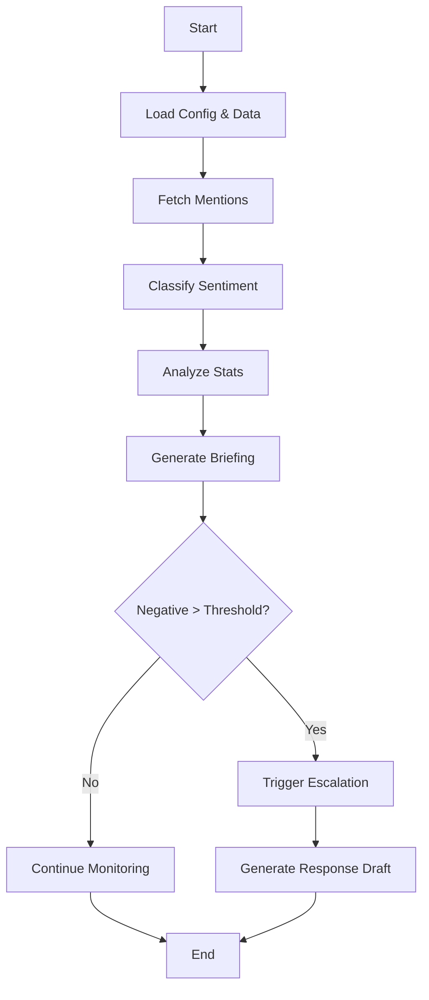

# Media Monitoring Agent - Project Overview

## 📁 Complete Project Structure

```
media-monitoring-agent/
│
├── src/                          # Source code
│   ├── __init__.py              # Package initialization
│   ├── server.py                # Main MCP server with 6 tools
│   └── utils.py                 # Helper functions
│
├── data/                         # Data files (separated from code)
│   ├── mock_mentions.json       # Sample brand mentions (8 examples)
│   └── sentiment_keywords.json  # Keywords for sentiment classification
│
├── config/                       # Configuration files
│   └── settings.json            # Thresholds, templates, topic keywords
│
├── .aitk/                        # AI Toolkit configuration
│   └── mcp.json                 # MCP server configuration
│
├── client.py                     # Demo client script
├── test_setup.py                # Setup verification script
├── requirements.txt              # Python dependencies
├── .env.example                  # Example environment variables
├── .gitignore                    # Git ignore rules
└── README.md                     # Documentation
```

## 🔧 Key Design Decisions

### 1. **Separation of Concerns**
- **Code** (`src/`): Business logic and MCP tools
- **Data** (`data/`): Mock mentions and keywords (easily replaceable)
- **Config** (`config/`): Settings, thresholds, templates

### 2. **Easy Customization**
Edit JSON files without touching code:
- `data/mock_mentions.json` - Add/modify test data
- `data/sentiment_keywords.json` - Tune sentiment detection
- `config/settings.json` - Adjust thresholds and templates

### 3. **Modular Architecture**
- `utils.py`: Reusable functions (sentiment, stats, clustering)
- `server.py`: MCP tools (API layer)
- `client.py`: Demo/testing (usage examples)

## 🚀 Quick Start Commands

```bash
# 1. Setup verification
python test_setup.py

# 2. Run demo (recommended first step)
python client.py

# 3. Start MCP server
cd src && python server.py

# 4. Install dependencies (if needed)
pip install -r requirements.txt
```

## 📊 Data Files Explained

### `data/mock_mentions.json`
Contains 8 sample mentions:
- 4 positive (50%)
- 2 negative (25%)
- 2 neutral (25%)

Covers scenarios:
- Product launches
- Delivery complaints
- Technical issues
- Customer service praise

**To customize**: Edit this file to test different scenarios.

### `data/sentiment_keywords.json`
Three categories:
- `positive_keywords`: 18 words (love, great, amazing...)
- `negative_keywords`: 15 words (terrible, frustrated, bugs...)
- `neutral_keywords`: 8 phrases (mixed feelings, shows promise...)

**To customize**: Add industry-specific terms.

### `config/settings.json`
Configures:
- Escalation threshold (30% negative)
- Severity levels (low/medium/high)
- Topic detection keywords
- Response templates (professional/empathetic)

**To customize**: Adjust thresholds for your needs.

## 🛠️ How to Extend

### Add New Data Source
1. Create new JSON file in `data/`
2. Add loader function in `utils.py`
3. Use in `server.py` tools

### Add New Tool
```python
@server.tool()
async def your_new_tool(param: str) -> str:
    """Your tool description"""
    # Your logic here
    return json.dumps(result)
```

### Connect Real APIs
Replace `load_mock_mentions()` in `server.py`:
```python
def fetch_from_twitter_api(brand: str):
    # Your API integration
    return mentions
```

## 🔄 Workflow



## 📈 Production Checklist

- [ ] Replace mock data with real API calls
- [ ] Add environment variables for API keys
- [ ] Implement rate limiting
- [ ] Add logging
- [ ] Set up scheduled runs (cron/scheduled tasks)
- [ ] Add error notifications (email/Slack)
- [ ] Create database for historical tracking
- [ ] Add authentication for MCP server
- [ ] Implement caching for frequent queries
- [ ] Add unit tests

## 🎓 Learning Resources

- **MCP Documentation**: Understanding the protocol
- **FastMCP**: Server framework used
- **Sentiment Analysis**: Keyword-based vs ML approaches
- **Social Media APIs**: Twitter, Reddit, LinkedIn integration

## 📝 File Sizes

- `server.py`: ~300 lines (main logic)
- `utils.py`: ~100 lines (helpers)
- `client.py`: ~130 lines (demo)
- `mock_mentions.json`: 8 sample mentions
- Total: Clean, modular, maintainable

---

**Status**: ✅ Ready for demo and extension
**Next**: Run `python client.py` to see it in action!
