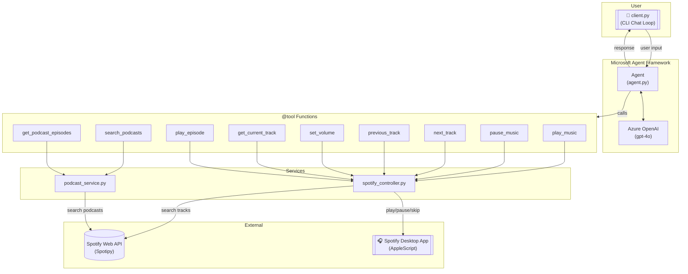

# Spotify Agent

AI-powered Spotify assistant built with [Microsoft Agent Framework](https://github.com/microsoft/agent-framework) and Azure OpenAI. Controls music playback via AppleScript and discovers podcasts via the Spotify Web API.

## Features

- **Music Playback** — Play, pause, skip, previous track, volume control
- **Now Playing** — Get current track info (name, artist, album, state)
- **Podcast Discovery** — Search podcasts and browse episodes
- **Podcast Playback** — Play specific podcast episodes
- **Conversational** — Natural language interaction

## Prerequisites

- **macOS** (uses AppleScript for Spotify control)
- **Python 3.10+**
- **Spotify Desktop App** installed and logged in
- **Azure OpenAI** resource with a deployed model (e.g. `gpt-4o`)
- **Azure CLI** logged in (`az login`)
- **Spotify Developer App** for search/podcasts ([developer.spotify.com](https://developer.spotify.com/dashboard))

## Setup

1. **Install dependencies:**
   ```bash
   pip install -r requirements.txt
   ```

2. **Configure environment:**
   ```bash
   cp .env.example .env
   # Edit .env with your Azure OpenAI and Spotify credentials
   ```

3. **Login to Azure CLI:**
   ```bash
   az login
   ```

4. **Run the agent:**
   ```bash
   python client.py
   ```

## Usage

```
🎵 Spotify Agent (type 'quit' to exit)
----------------------------------------

You: Play some jazz music
Agent: 🎵 Now playing jazz music on Spotify!

You: Search for tech podcasts
Agent: Here are some tech podcasts I found: ...

You: Play the latest episode of the first one
Agent: 🎧 Playing the latest episode!

You: What's currently playing?
Agent: Currently playing "Kind of Blue" by Miles Davis
```

## Architecture



### File Structure

```
spotify-agent/
├── client.py                 # CLI chat loop
├── requirements.txt
├── .env.example
└── src/
    ├── agent.py              # Agent + Azure OpenAI setup with @tool functions
    ├── spotify_controller.py # AppleScript-based Spotify control + search
    └── podcast_service.py    # Spotify Web API podcast search
```

### Tools

| Tool | Description |
|------|-------------|
| `play_music` | Play/search music |
| `pause_music` | Pause playback |
| `next_track` | Skip to next |
| `previous_track` | Go back |
| `set_volume` | Set volume 0-100 |
| `get_current_track` | Now playing info |
| `search_podcasts` | Find podcasts |
| `get_podcast_episodes` | List episodes |
| `play_episode` | Play a podcast episode |
